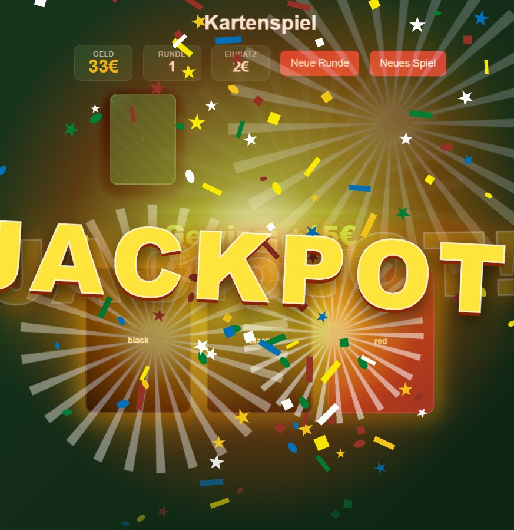
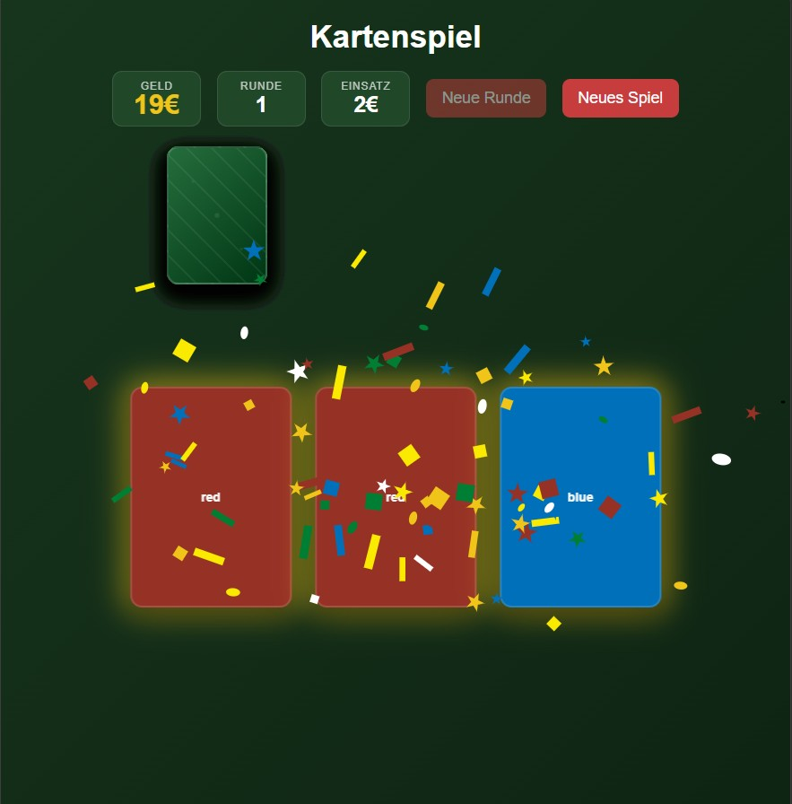
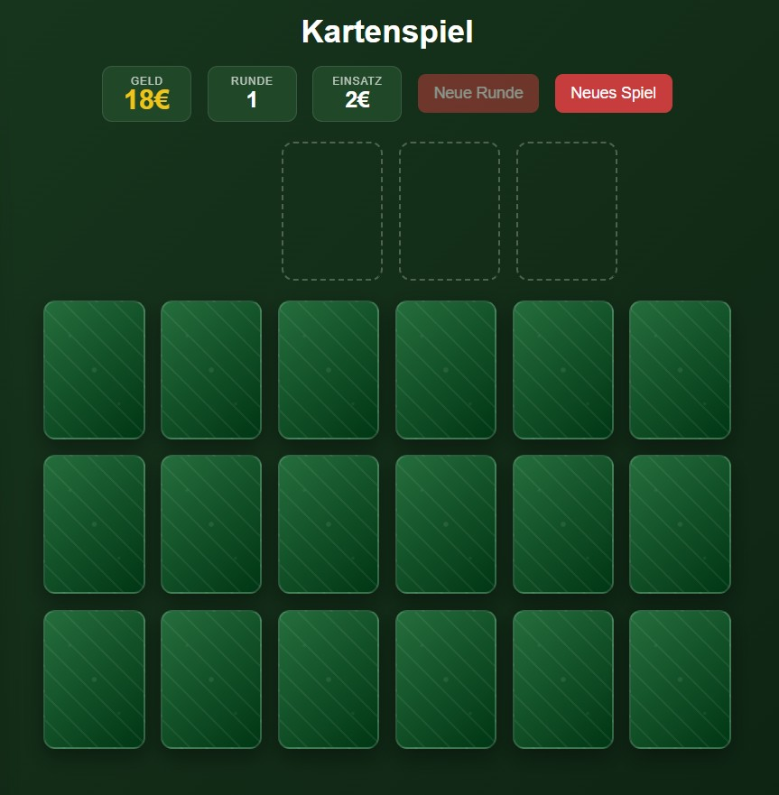

# Card Gambling Game

> A browser-based card gambling game with animated dealing, flip effects, money tracking, and dramatic win/lose reactions.

<p align="center">
  
  
  
</p>

## Features

- Animated card dealing and flipping.
- Money and round tracking.
- Win, lose, and jackpot effects.
- Responsive layout for different screen sizes.
- Simple and easy-to-understand code structure.

## Preview

The game includes dramatic result animations:

- Jackpot celebration.
- Win glow and confetti.
- Loss shake and red flash.


## How to Run

### Download

1. Click the green **Code** button on GitHub.
2. Choose **Download ZIP**.
3. Extract the ZIP file.
4. Open `index.html`.

### Clone Repository

in the Terminal write:
```bash
git clone git@github.com:LarsDEB/Card_Gambling_Game.git
```


## Project Structure

```
.
├── index.html
├── style.css
├── script.js
└── assets/
    ├── preview.gif
    ├── jackpot.png
    ├── win.png
    └── game-over.png
```

## How It Works

- The game creates a shuffled deck.
- You reveal cards one by one.
- After three cards are revealed, the result is evaluated.
- The game then shows the result with animations and updates your money.

## Tech Stack

- HTML
- CSS
- JavaScript
